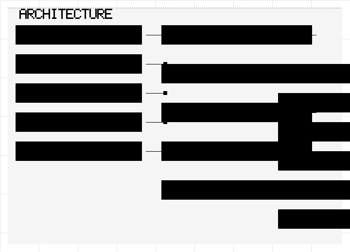

# Saudi AI Career Intelligence

AI-powered labor market intelligence for Saudi Arabia's AI, data, and technology careers.

## Project overview

Saudi AI Career Intelligence is a practical AI/data portfolio project that turns Saudi job market data and national strategy documents into actionable career decision support. The repository combines job-posting parsing, market analysis, Power BI-ready exports, and a planning foundation for a retrieval-augmented career assistant.

## Motivation

Students, recruiters, and early-career technologists need a clearer signal about which skills, roles, and sectors Saudi AI employers are actually hiring for. This project was built from real LinkedIn job postings and strategy documents to create grounded, evidence-driven labor market intelligence.

## Problem statement

Saudi AI and data career search is fragmented:

- Job descriptions use inconsistent language across AI, data, and software tracks.
- Skills and role titles overlap in ways that make resume positioning difficult.
- National strategy documents are hard to connect to actual hiring demand.

This project makes the data usable for resume preparation, portfolio planning, and recruiter-facing insights.

## Current dataset

- 72 parsed LinkedIn job postings
- Role category breakdown
- Sector breakdown
- Skills and tools frequency analysis
- Power BI-ready CSV exports
- Raw text and structured processed outputs

## System architecture

The architecture has two core tracks:

1. Market intelligence pipeline
2. Retrieval-Augmented Generation (RAG) assistant



### Raw sources

- LinkedIn job postings
- Vision 2030 reports
- AI governance documents
- Skills frameworks
- Personal profile

### Market analysis flow

Data ingestion → parsing and cleaning → market analysis pipeline → Power BI-ready CSVs → dashboard insights

### RAG flow

Documents → chunking → embeddings → vector database → RAG assistant → career recommendations

## Features

- Job posting parsing from raw application documents
- Skill/tool extraction and normalization
- Role and sector classification
- Power BI-ready analytics exports
- RAG assistant architecture planned
- Resume and portfolio-ready insight generation

## Market analysis pipeline

Scripts convert parsed job postings into:

- Role category summaries
- Sector frequency tables
- Top skills and tools
- Company signal tables
- Seniority and location breakdowns
- Recommendation guidance for portfolio projects

## Power BI dashboard plan

A dedicated guide supports Power BI dashboard design using `data/market_analysis/powerbi`. The dashboard is designed to surface:

- total jobs analyzed
- role categories in demand
- sector distribution
- skill/tool signals
- location and seniority patterns
- project recommendation evidence

## RAG assistant plan

A Streamlit prototype skeleton is available in `src/app.py`. The planned assistant will:

- index job postings and strategy documents
- retrieve relevant career intelligence chunks
- answer questions about Saudi AI roles, skills, and project roadmaps
- support grounded recommendations with source citations

## Results & progress

- 72 parsed LinkedIn job postings processed into structured datasets
- Role category breakdown completed
- Sector distribution and company frequency reports generated
- Skills and tools frequency analysis produced
- Power BI-ready exports assembled in `data/market_analysis/powerbi`
- Streamlit/RAG prototype skeleton built in `src/app.py`
- Architecture diagram created in `docs/architecture.png`

### In progress / planned

- Full RAG assistant deployment
- Streamlit interface refinement
- Dashboard visuals and screenshot assets
- Docker-ready deployment
- Additional Saudi strategy document indexing

## Repository structure

- `data/` — raw inputs, processed job postings, market analysis exports
- `docs/` — architecture diagram, project story, dashboard guide, roadmap, resume bullets
- `scripts/` — data parsing and analysis pipelines
- `src/` — prototype app, document ingestion, chunking, embeddings, retrieval
- `.env.example` — API key template
- `requirements.txt` — Python dependencies

## How to run

1. Install dependencies:
   ```bash
   pip install -r requirements.txt
   ```
2. Add your OpenAI key:
   ```bash
   copy .env.example .env
   ```
3. Parse raw job postings:
   ```bash
   python scripts/parse_job_applications.py
   ```
4. Generate market outputs:
   ```bash
   python scripts/analyze_market.py
   ```
5. Run the Streamlit prototype:
   ```bash
   streamlit run src/app.py
   ```

## Roadmap

- Complete a production-ready Power BI dashboard
- Build the RAG retrieval pipeline with Chroma embeddings
- Add a student-facing Streamlit recommendation interface
- Dockerize the application
- Share the project as a portfolio asset for recruiters, AI engineers, and early-career technologists

## Resume impact

This project demonstrates:

- AI/product thinking with labor market analytics
- Data engineering for real job-market inputs
- Model-backed career recommendation planning
- Dashboard and decision-support readiness
- Hands-on experience with LangChain, vector search, and Streamlit

## Screenshots

- `screenshots/dashboard-preview.png`
- `screenshots/data-pipeline.png`
- `screenshots/rag-assistant-preview.png`

> Notes: These are placeholder assets. Replace them with actual dashboard and prototype screenshots as the project evolves.
